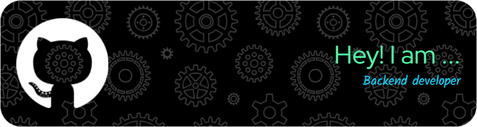

<!-- En üstte sadece tek bir resim/banner koymak için -->

<h1 align="center">Hi 👋, I'm Ravan</h1>
<h3 align="center">.NET Backend Developer | C# Enthusiast | Onion Architecture Follower</h3>

---

- 🔭 I'm currently working on the backend of a project called **OtaqAz**  
- 💬 My primary language is **C#**, and I'm building applications using the **.NET ecosystem**
- 🧠 I'm focused on Onion Architecture, Entity Framework, and scalable REST APIs
- 🤝 Open to collaborate on backend projects and architecture discussions
- 📫 Let's connect:  

  
  
  
  

---

### ⚙️ Technologies & Tools

  
  
  
  
  
  
  
  
  
  
  

---

### 📈 GitHub Stats

  

  
  

  

---

### ✨ A Touch of Personality

  

